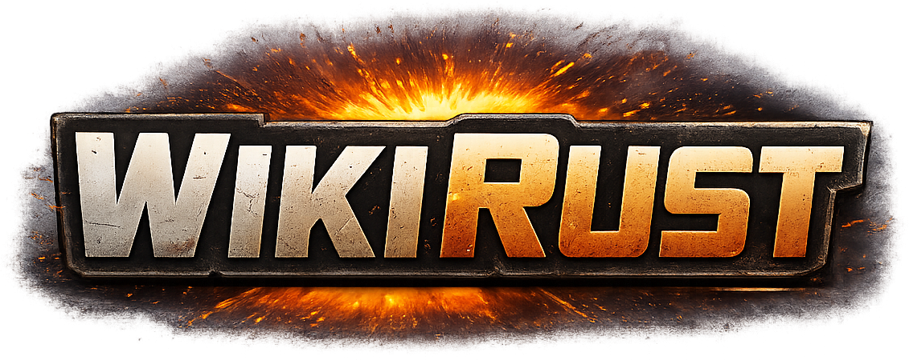
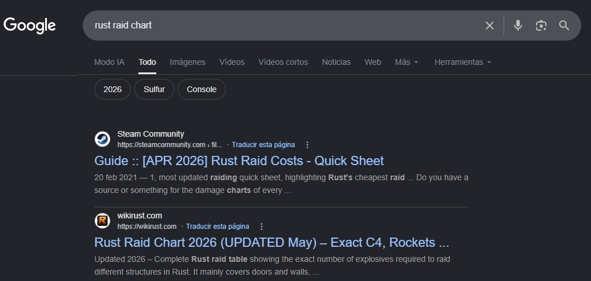
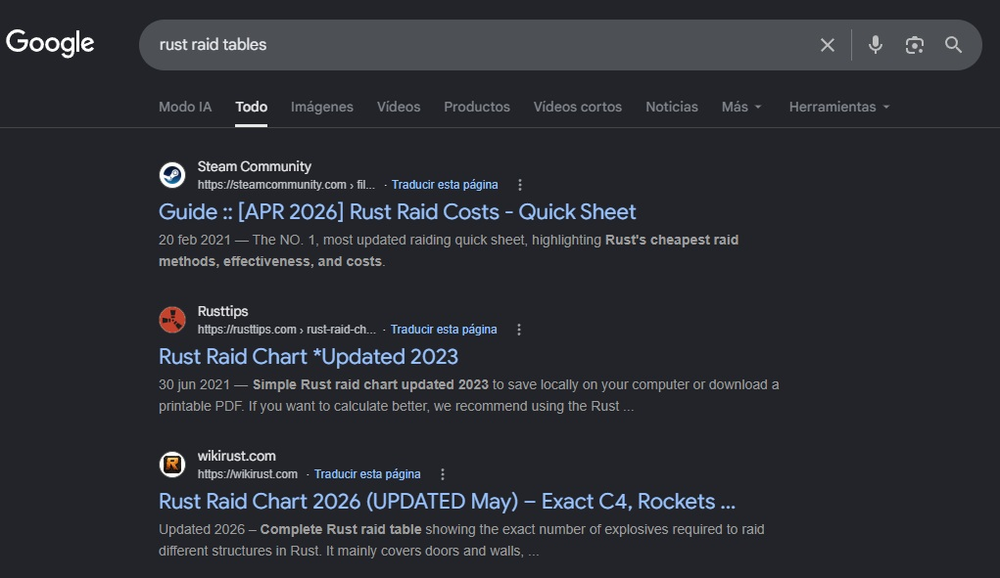
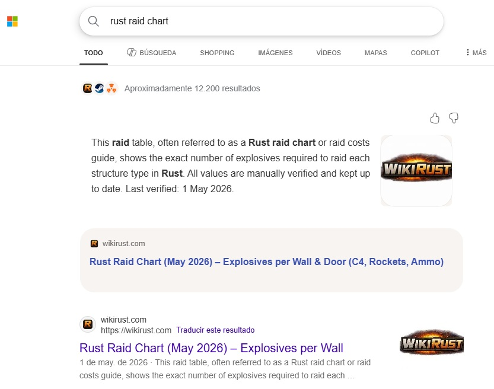

# WikiRust — SEO Case Study

## Cómo posicioné una web nueva hasta Top 2 en Google sin backlinks relevantes

 

  

 

# 1. Resumen ejecutivo

[WikiRust](https://wikirust.com) es un proyecto centrado en el videojuego Rust, orientado a consultas relacionadas con destrucción de estructuras y uso de explosivos dentro del juego.

La web fue construida alrededor de una arquitectura temática basada en:
- explosivos
- puertas
- muros y estructuras
- armas

Combinando:
- tablas rápidas de consulta en la home principal
- hubs temáticos
- páginas específicas por estructura y explosivo
- contenido orientado a intención de búsqueda

El objetivo del proyecto era comprobar si una web nueva, centrada en resolver rápidamente consultas muy específicas de usuarios, podía posicionarse en Google mediante:
- arquitectura SEO
- buena experiencia de usuario
- contenido de consulta rápida
- optimización on-page

Sin depender de autoridad previa ni campañas de linkbuilding.

En menos de 4 meses, el proyecto consiguió:

- Top 2 en Google para “rust raid chart”
- Top 3 en Google para “rust raid wiki”
- Top 1 en Bing para ambas búsquedas principales
- ~1000 visitas orgánicas semanales
- Aprobación de Google AdSense
- Primeros ingresos orgánicos reales
- Indexación limpia y sin problemas técnicos relevantes

---

# 2. Contexto del proyecto

Wikirust fue mi primera web orientada a usuarios reales y tráfico orgánico real, más allá de proyectos de aprendizaje o portfolio.

El proyecto comenzó a mediados de enero de 2026 con un objetivo claro:

> Construir una web realmente útil para jugadores de Rust y comprobar si era posible competir en Google mediante utilidad real, buena arquitectura SEO y experiencia de usuario.

El nicho elegido fue el de búsquedas relacionadas con destrucción de estructuras dentro del juego.

Dentro de Rust, “raiding” es el proceso de destruir puertas, muros y estructuras enemigas utilizando explosivos para acceder a bases de otros jugadores.

En lugar de intentar construir una wiki generalista sobre Rust, el proyecto se centró únicamente en este segmento concreto del juego.

La intención era especializar la web en una necesidad muy específica:
- consultar rápidamente qué explosivos son necesarios para destruir determinadas estructuras
- mostrar únicamente los elementos más utilizados por los jugadores

La home principal se diseñó como una herramienta de consulta rápida mediante tablas visuales, permitiendo comprobar rápidamente:
- cuántos explosivos necesita cada estructura para ser destruida
- qué tipos de explosivos funcionan sobre cada puerta, muro o estructura

Además, el proyecto incorporó hubs temáticos y páginas específicas por estructura.

Con el objetivo de cubrir tanto:
- búsquedas rápidas durante gameplay
como
- búsquedas más específicas relacionadas con estructuras concretas dentro del juego.

Esta decisión permitió mantener:
- una intención de búsqueda altamente específica
- una experiencia de usuario más enfocada

El objetivo no era cubrir “todo Rust”, sino intentar convertir Wikirust en una referencia especializada dentro del segmento de raids y destrucción de estructuras.

Desde el principio se priorizó:
- rapidez de consulta
- claridad visual
- navegación simple
- utilidad inmediata

---

# 3. Problema detectado

Durante el análisis inicial detecté varios problemas comunes en webs del nicho:

- Información desactualizada
- Tablas difíciles de consultar
- Navegación confusa
- Exceso de texto irrelevante
- Mala experiencia móvil
- Contenido poco estructurado

La hipótesis principal fue:

> Si la web conseguía responder la intención de búsqueda más rápido y de forma más clara que la competencia, sería posible posicionar incluso frente a dominios consolidados con años de antigüedad y mayor autoridad.

---

# 4. Objetivos SEO

Los objetivos iniciales del proyecto fueron:

- Posicionar keywords principales relacionadas con raids en Rust
- Conseguir indexación rápida
- Crear una arquitectura escalable
- Validar crecimiento SEO sin backlinks relevantes
- Generar tráfico recurrente desde búsquedas gaming

Keywords principales objetivo:
- “rust raid chart”
- “rust raid tables”
- “rust raid wiki”
- “rust explosive damage”

---

# 5. Estrategia SEO

## 5.1 Arquitectura tipo Hub & Spoke

La estructura de la web se diseñó utilizando una arquitectura tipo hub & spoke.

### Página principal
- Raid chart general

### Hubs secundarios
- `/doors/`
- `/walls/`
- `/explosives/`
- `/weapons/`

### Páginas individuales
Cada estructura o explosivo tenía su propia URL optimizada.

La estrategia no consistió únicamente en crear categorías, sino en construir clusters temáticos completos conectados mediante interlinking contextual.

Esta arquitectura permitió:
- distribuir relevancia temática
- mejorar el enlazado interno
- facilitar indexación
- atacar búsquedas long-tail
- escalar contenido fácilmente

---

# 6. Estrategia de contenido y UX

La estrategia de contenido se centró completamente en resolver la intención de búsqueda lo más rápido posible.

La home principal se diseñó como una herramienta de consulta rápida mediante tablas visuales.

Los hubs y páginas específicas, en cambio, se centraron en:
- organización temática
- contexto semántico
- navegación interna
- contenido específico por estructura

## Decisiones clave

### Uso de tablas rápidas en la home
La home principal resolvía inmediatamente la intención principal de búsqueda mostrando:
- estructuras
- explosivos
- cantidades necesarias

Sin necesidad de navegar entre múltiples páginas.

### Contenido contextual en hubs y páginas hijas
Los hubs y páginas específicas añadían contexto semántico adicional mediante:
- descripciones
- características de estructuras
- navegación relacionada
- interlinking contextual

### Eliminación de relleno innecesario
Se evitó añadir texto artificial únicamente para aumentar longitud.

### Prioridad absoluta a la UX
El usuario debía encontrar rápidamente:
- cuántos explosivos necesita una estructura
- qué opciones de raid existen para cada estructura
- información útil sin fricción

---

## 6.1 UX orientada al contexto real de uso

La experiencia visual de la web fue diseñada específicamente pensando en cómo los jugadores de Rust consumen este tipo de contenido.

La mayoría de usuarios consultan este tipo de información:
- mientras juegan
- desde una segunda pantalla
- desde el móvil
- durante sesiones nocturnas

Por ello, se eligió una interfaz:
- simple
- oscura
- con alto contraste
- rápida de escanear

El objetivo era reducir al mínimo el tiempo necesario para obtener información útil durante gameplay.

Las tablas y elementos visuales fueron diseñados priorizando:
- legibilidad
- rapidez de lectura
- accesibilidad en pantallas pequeñas
- comodidad visual en entornos oscuros

---

# 7. Validación manual y metodología

A finales de abril de 2026 se añadió una página específica de metodología.

Esta sección documentaba:
- cómo se realizaban las pruebas
- entorno utilizado dentro del juego
- validación manual de daños
- proceso de comprobación manual

Esto aportó varios beneficios importantes.

## Credibilidad
Los datos no provenían de scraping ni de reutilización automática de contenido.

## Diferenciación
Muy pocas webs del nicho muestran cómo obtienen y verifican sus datos.

## Mejora de confianza
La transparencia del proceso ayudó a reforzar:
- precisión
- experiencia
- calidad del contenido

---

# 8. SEO On-Page

Se optimizaron múltiples elementos clave de SEO on-page.

## Titles
Titles orientados a:
- keyword principal
- claridad
- CTR

## Headings
Jerarquía semántica clara:
- H1 principal
- H2 organizativos
- estructura fácil de escanear

## URLs limpias
URLs cortas y descriptivas:
- `/doors/`
- `/walls/`
- `/explosives/`
- `/weapons/`

## Interlinking
Fuerte enlazado interno entre:
- hubs
- páginas específicas
- contenido relacionado

---

# 9. SEO Técnico

El proyecto mantuvo una estructura técnica limpia desde el principio.

## Implementaciones realizadas

- HTTPS correctamente configurado
- Sitemap XML mediante Yoast SEO
- Correcta indexación en Google Search Console
- Gestión adecuada de redirects y 404
- Exclusión correcta de URLs irrelevantes
- Ausencia de errores críticos de rastreo

---

# 10. Crecimiento SEO

## Mediados de enero 2026
Lanzamiento inicial de la web:
- home principal
- páginas legales
- estructura base

Durante la primera semana tras publicar la home, la web alcanzó aproximadamente posición 14 para búsquedas como:
- “rust raid chart”
- “rust raid tables”

Esto validó rápidamente que Google entendía correctamente la temática y relevancia del sitio pese a tratarse de un dominio nuevo.

---

## Finales de enero 2026
Publicación de los primeros hubs temáticos junto con sus páginas específicas relacionadas:
- walls
- doors

La arquitectura interna comenzó a expandirse mediante clusters de contenido interconectados, mejorando la cobertura semántica y el enlazado interno del sitio.

---

## Mediados de febrero 2026
Publicación del hub:
- weapons

Incluyendo nuevas páginas específicas relacionadas con armas y daño explosivo.

---

## Mediados de marzo 2026
Publicación del hub:
- explosives

Junto con nuevas URLs específicas orientadas a explosivos concretos y sus usos dentro del juego.

---

## Finales de abril 2026
Publicación de la página methodology.

Además, el 29 de abril de 2026 el proyecto fue aprobado por Google AdSense.

---

## Principios de mayo de 2026
Consolidación en primeras posiciones:
- Top 2 para “rust raid chart”
- Top 3 para “rust raid wiki”
- Top 1 en Bing para ambas búsquedas principales

Tráfico aproximado:
- ~1000 visitas orgánicas semanales

---

# 11. Resultados obtenidos

## Rankings

Principales posiciones alcanzadas:

### Google
- Top 2 para “rust raid chart”
- Top 3 para “rust raid wiki”

### Bing
- Top 1 para búsquedas principales relacionadas con Rust raid charts

---

---

---

---

## Tráfico orgánico

Actualmente el proyecto alcanza aproximadamente ~1000 visitas orgánicas semanales, manteniendo un crecimiento mensual cercano al 50% desde su lanzamiento.

La mayoría del tráfico proviene de:
- búsquedas orgánicas
- 80% usuarios de Estados Unidos
- queries altamente específicas

---

## Descubrimiento mediante IA

El proyecto también comenzó a recibir algunas visitas desde plataformas de IA generativa como:
- ChatGPT
- Google Gemini

Esto sugiere que parte del contenido ya estaba siendo reconocido y utilizado como referencia contextual para responder consultas relacionadas con Rust raid charts.

---

## Monetización

Actualmente:
- anuncios implementados
- 2 anuncios por URL
- primeros ingresos orgánicos reales acumulados

Aunque los ingresos iniciales todavía son bajos, validan:
- calidad del tráfico
- viabilidad del proyecto
- potencial de crecimiento futuro

---

# 12. Insights y aprendizajes

## La especialización temática ayudó al posicionamiento
Centrarse únicamente en raids y destrucción de estructuras permitió mantener:
- una arquitectura coherente
- una intención de búsqueda clara
- contenido altamente alineado con las consultas principales

---

## La intención de búsqueda fue más importante que la longitud del contenido
Las páginas más útiles y rápidas de consultar obtuvieron mejor rendimiento.

---

## La arquitectura interna tuvo un impacto importante
La estructura hub & spoke facilitó:
- indexación
- rastreo
- relevancia temática

---

## El contenido práctico funcionó mejor que el contenido genérico
Las tablas y datos rápidos generaron mejor respuesta que artículos largos tradicionales.

---

## El contexto de uso influyó en decisiones UX
Diseñar la web pensando en jugadores usando una segunda pantalla o móvil durante gameplay ayudó a crear una experiencia más cómoda y rápida de consultar.

---

## Google respondió rápidamente a la relevancia del contenido
El hecho de alcanzar posición 14 en aproximadamente una semana demostró una alineación fuerte entre:
- intención de búsqueda
- estructura semántica
- contenido útil

---

## No fueron necesarios backlinks fuertes para competir inicialmente
El crecimiento se consiguió principalmente mediante:
- utilidad
- estructura SEO
- relevancia temática

---

# 13. Limitaciones actuales

El proyecto todavía tiene margen de mejora en varias áreas:

- Autoridad externa todavía limitada
- Estrategia de backlinks prácticamente inexistente
- Monetización todavía temprana

---

# 14. Próximos pasos

## Linkbuilding
Construcción de autoridad mediante backlinks reales y menciones relevantes.

## Optimización de CTR
Mejora de snippets y titles para aumentar clics orgánicos.

## Escalabilidad
Ampliación de contenido manteniendo la misma arquitectura temática.

---

# 15. Conclusión

Wikirust demostró que una web nueva puede posicionarse en Google mediante:
- buena arquitectura SEO
- especialización temática
- contenido útil
- enfoque en intención de búsqueda
- SEO técnico limpio

Incluso sin autoridad previa ni campañas de backlinks.

El proyecto validó mi capacidad para:
- diseñar arquitecturas SEO
- ejecutar estrategias on-page
- analizar intención de búsqueda
- optimizar experiencia de usuario
- construir crecimiento orgánico real desde cero.
