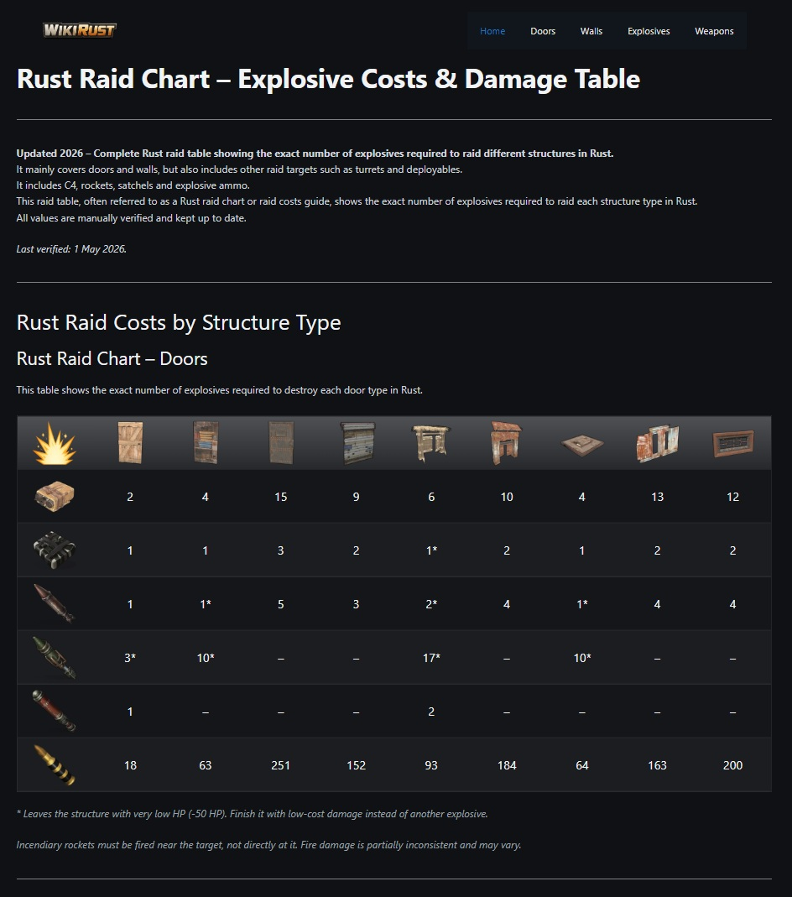

# WikiRust
 

## SEO Case Study

Detailed SEO case study explaining:
- SEO architecture
- UX decisions
- content strategy
- growth timeline
- rankings and organic visibility

[Read the full case study (Spanish)](./CASE_STUDY.md)

---
 

  

 

WikiRust is an independent web project focused on structured raid and explosive damage information for the video game Rust.

The project focuses on quick-reference raid information and structure destruction data:

- Raid explosive damage tables
- Door types and durability
- Wall resistance
- Base security mechanics

All data is manually verified and kept up to date.

**WikiRust official website:**

https://wikirust.com/

## Project status
Actively maintained and expanding content.  
Early-stage project with growing organic visibility.

## Scope
WikiRust focuses on clear and practical information for players who want quick and reliable answers when planning raids or base defenses.

## Technologies
- WordPress
- GeneratePress (theme)
- TablePress (plugin)
- Custom CSS

## Preview

  

## Purpose
Personal educational project focused on building and maintaining a real-world web product.
