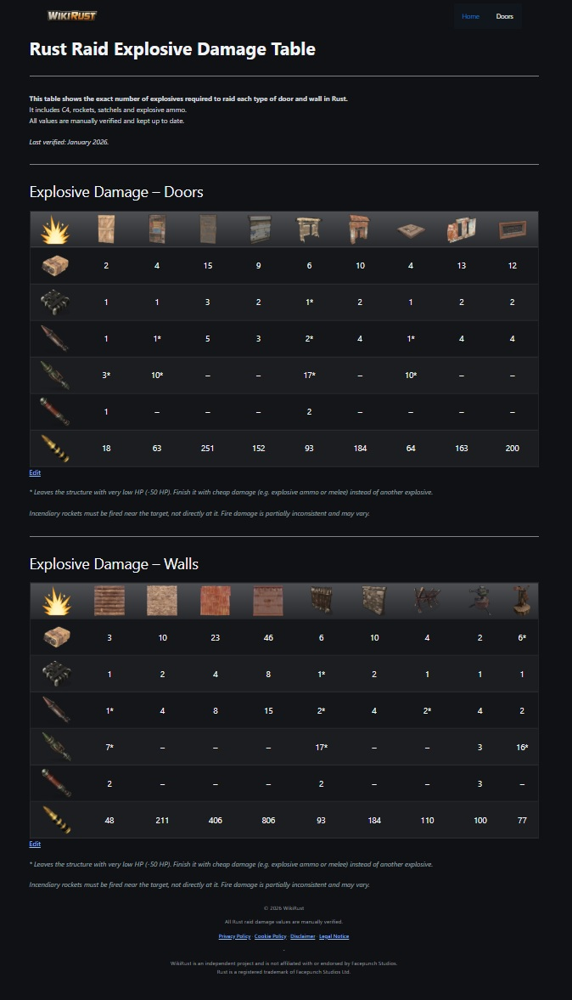

# WikiRust

  

WikiRust is an independent wiki project focused on providing accurate and structured data about the video game Rust.

The project is centered on practical game mechanics and includes detailed information such as:

- Raid explosive damage tables
- Door types and durability
- Wall resistance
- Base security mechanics

All data is manually verified and kept up to date.

**WikiRust official website:**
https://wikirust.com

## Project status
Actively maintained and expanding content.  
Early-stage project with growing organic visibility.

## Scope
WikiRust focuses on clear and practical information for players who want quick and reliable answers when planning raids or base defenses.

## Technologies
- WordPress
- GeneratePress (theme)
- TablePress (plugin)
- Custom CSS

## Preview

  

## Purpose
Personal educational project focused on building and maintaining a real-world web product.
